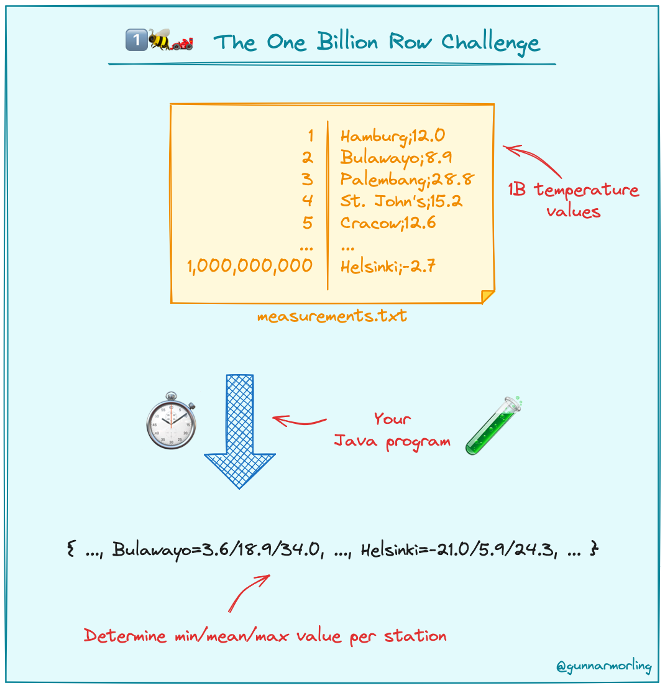

# 1️⃣🐝🏎️ The One Billion Row Challenge with Rust

## About the Challenge

The One Billion Row Challenge (1BRC) is a fun exploration of how far modern Java
can be pushed for aggregating one billion rows from a text file.

Later the community created a dedicated @1brc organization to pay more attention
to the implementations in other languages. This repository contains and accepts
Rust based implementations.

Grab all your (virtual) threads, reach out to SIMD, optimize your GC, or pull
any other trick, and create the fastest implementation for solving this task!



The text file contains temperature values for a range of weather stations. Each
row is one measurement in the format
`<string: station name>;<double: measurement>`, with the measurement value
having exactly one fractional digit. The following shows ten rows as an example:

```
Hamburg;12.0
Bulawayo;8.9
Palembang;38.8
St. John's;15.2
Cracow;12.6
Bridgetown;26.9
Istanbul;6.2
Roseau;34.4
Conakry;31.2
Istanbul;23.0
```

The task is to write a program which reads the file, calculates the min, mean,
and max temperature value per weather station, and emits the results on stdout
like this (i.e. sorted alphabetically by station name, and the result values per
station in the format `<min>/<mean>/<max>`, rounded to one fractional digit):

```
{Abha=-23.0/18.0/59.2, Abidjan=-16.2/26.0/67.3, Abéché=-10.0/29.4/69.0, Accra=-10.1/26.4/66.4, Addis Ababa=-23.7/16.0/67.0, Adelaide=-27.8/17.3/58.5, ...}
```

Submit your implementation and become part of the leaderboard!

## Results

| #   | Result (m:s.ms) | Implementation                                                                  | Submitter                                        | Notes                                                                                                                                                                                                                                                                                                                 |
| --- | --------------- | ------------------------------------------------------------------------------- | ------------------------------------------------ | --------------------------------------------------------------------------------------------------------------------------------------------------------------------------------------------------------------------------------------------------------------------------------------------------------------------- |
| 1.  | 02:15.064       | [link](https://github.com/1brc/bun/blob/main/src/main/bun/Edgar-P-yan/index.ts) | [Edgar Pogosyan](https://github.com/Edgar-P-yan) | Potentially multi-threaded (there is a [bug in Bun](https://github.com/oven-sh/bun/issues/6557#issuecomment-1883642980), which does not let us use more than one core for now, but when that gets fixed, this could potentially run in about 14s), optimized parsing, input-specific `float` to `int` parser, no mmap |
|     | 05:49.890       | [link](https://github.com/1brc/bun/blob/main/src/main/bun/baseline/index.ts)    | [Edgar Pogosyan](https://github.com/Edgar-P-yan) | The baseline, single threaded, naive implementation                                                                                                                                                                                                                                                                   |

See [below](#entering-the-challenge) for instructions how to enter the challenge
with your own implementation.

## Prerequisites

1. [Java 22](https://openjdk.org/projects/jdk/22/) to generate the
   `measurements.txt` files and optionally run tests.
2. [Rust](https://www.rust-lang.org/learn/get-started) must be installed on your
   system.

## Running the Challenge

This repository contains two programs:

- `dev.morling.onebrc.CreateMeasurements` (invoked via
  _create_measurements.sh_): Creates the file _measurements.txt_ in the root
  directory of this project with a configurable number of random measurement
  values
- `src/main/rust/baseline/main.rs` (invoked via
  _calculate_average_baseline.sh_): Calculates the average values for the file
  _measurements.txt_

Execute the following steps to run the challenge:

1. Build the project using Apache Maven:

   ```
   ./mvnw clean verify
   ```

2. Create the measurements file with 1B rows (just once):

   ```
   ./create_measurements.sh 1000000000
   ```

   This will take a few minutes. **Attention:** the generated file has a size of
   approx. **12 GB**, so make sure to have enough diskspace.

3. Calculate the average measurement values:

   ```
   ./calculate_average_baseline.sh
   ```

   ~~The provided naive example implementation completes the task in ~6m16s on
   environment used for [result evaluation](#evaluating-results). It serves as
   the base line for comparing your own implementation.~~\
   The baseline is not yet implemented.

4. Optimize the heck out of it:

   Adjust the `src/main/rust/baseline/main.rs` program to speed it up, in any
   way you see fit (just sticking to a few rules described below). Options
   include parallelizing the computation, memory-mapping different sections of
   the file concurrently, choosing and tuning the garbage collector, and much
   more.

## Flamegraph/Profiling

> TODO: add instructions on how to profile Rust programs

## Rules and limits

- No external library dependencies may be used
<!-- - Implementations must be provided as a single source file -->
- The computation must happen at application _runtime_, i.e. you cannot process
  the measurements file at _build time_ and just bake the result into the binary
- Input value ranges are as follows:
  - Station name: non null UTF-8 string of min length 1 character and max length
    100 bytes (i.e. this could be 100 one-byte characters, or 50 two-byte
    characters, etc.)
  - Temperature value: non null double between -99.9 (inclusive) and 99.9
    (inclusive), always with one fractional digit
- There is a maximum of 10,000 unique station names
- Implementations must not rely on specifics of a given data set, e.g. any valid
  station name as per the constraints above and any data distribution (number of
  measurements per station) must be supported

## Entering the Challenge

To submit your own implementation to 1BRC, follow these steps:

- Create a fork of the
  [janlucaklees/1bc-rust](https://github.com/janlucaklees/1bc-rust/) GitHub
  repository.
- Create a copy of `src/main/rust/baseline` directory, rename it to
  `src/main/rust/<your_GH_user>`, e.g. `src/main/rust/JohnDoe`.
- Make that implementation fast. Really fast.
- Create a copy of _calculate_average_baseline.sh_, named
  _calculate_average\_<your_GH_user>.sh_, e.g. _calculate_average_JohnDoe.sh_.
  Make sure that script does not write anything to standard output other than
  calculation results.
- Run the test suite by executing _/test.sh <your_GH_user>_; if any differences
  are reported, fix them before submitting your implementation.
- Create a pull request against the upstream repository, clearly stating
  - The execution time of the program and the baseline on your system and specs
    of the same (CPU, number of cores, RAM). This is for informative purposes
    only, the official runtime will be determined as described below.
- I might run the program and determine its performance as described in the next
  section, and enter the result to the scoreboard.

**Note:** I reserve the right to not evaluate specific submissions if I feel
doubtful about the implementation (I.e. I won't run your Bitcoin miner ;).

<!-- If you'd like to discuss any potential ideas for implementing 1BRC with the community,
you can use the [GitHub Discussions](https://github.com/gunnarmorling/onebrc/discussions) of this repository.
Please keep it friendly and civil. -->

## Evaluating Results

For now results are determined by running the program on an old MSI GE70 with an
i7-4700MQ. The `time` program is used for measuring execution times, i.e.
end-to-end times are measured. Each contender will be run five times in a row.
The slowest and the fastest runs are discarded. The mean value of the remaining
three runs is the result for that contender and will be added to the results
table above. The exact same _measurements.txt_ file is used for evaluating all
contenders.

## FAQ

_Q: What is the encoding of the measurements.txt file?_\
A: The file is encoded with UTF-8.

_Q: Can I make assumptions on the names of the weather stations showing up in
the data set?_\
A: No, while only a fixed set of station names is used by the data set generator,
any solution should work with arbitrary UTF-8 station names (for the sake of simplicity,
names are guaranteed to contain no `;` character).

_Q: Can I copy code from other submissions?_\
A: Yes, you can. The primary focus of the challenge is about learning something new,
rather than "winning". When you do so, please give credit to the relevant source
submissions. Please don't re-submit other entries with no or only trivial improvements.

_Q: Which operating system is used for evaluation?_\
A: Arch Linux (see [Evaluating Results](#evaluating-results))

_Q: My solution runs in 2 sec on my machine. Am I the fastest 1BRC-er in the
world?_\
A: Probably not :) 1BRC results are reported in wallclock time, thus results of different
implementations are only comparable when obtained on the same machine. If for instance
an implementation is faster on a 32 core workstation than on the 8 core evaluation
instance, this doesn't allow for any conclusions. When sharing 1BRC results, you
should also always share the result of running the baseline implementation on the
same hardware.

_Q: Why_ 1️⃣🐝🏎️ _?_\
A: It's the abbreviation of the project name: **One** **B**illion **R**ow **C**hallenge.

## License

This code base is available under the Apache License, version 2.

## Code of Conduct

Be excellent to each other! More than winning, the purpose of this challenge is
to have fun and learn something new.
